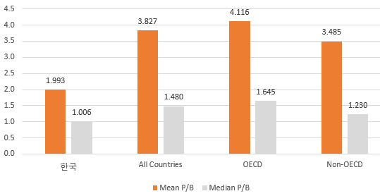
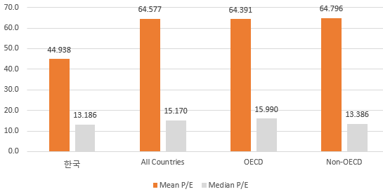
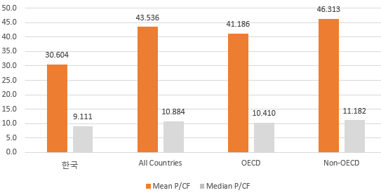
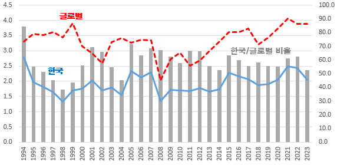
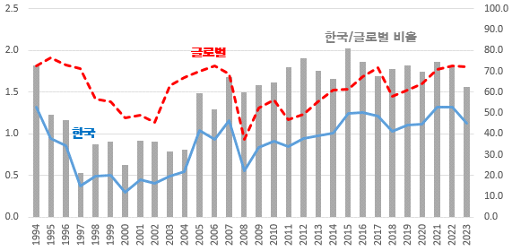

# An International Comparative Study on the Korea Discount and the Determinants of Valuation Multiple Changes

**Hyunseok Kim**
Assistant Professor, Department of IT Finance, Business School, Jeonju University
E-mail: khs8319@jj.ac.kr

## Abstract
This study empirically examines the existence of the Korea Discount across 48 countries and further investigates the key factors driving changes in valuation multiples. The analysis reveals that, over the period from 1990 to 2023, the Korean stock market has consistently exhibited lower valuation levels—measured by price-to-book (P/B) and price-to-earnings (P/E) ratios—relative to global markets. These findings indicate that the Korea Discount is not a short-term or cyclical phenomenon, but rather a persistent feature characterizing the Korean stock market for more than three decades. In addition, this study identifies countries that have experienced significant increases in valuation multiples over the long time and examines the key drivers of such improvements. The empirical results show that higher profitability, greater cash holdings, and more advanced financial market development are positively associated with increases in valuation multiples, whereas higher financial leverage, larger payout ratios, greater trading turnover, higher GDP per capita, and elevated geopolitical risk are negatively associated with multiple expansion. Overall, the findings suggest that mitigating the Korea Discount requires a long-term strategy focused on strengthening firms’ fundamental profitability and financial stability, as well as fostering the development of financial markets, rather than relying on short-term or transitory measures.

**Keywords:** Korea Discount, P/B Ratio, P/E Ratio, Value-Up

## I. Introduction
The "Korea Discount" refers to the phenomenon where the Korean stock market is significantly undervalued compared to major countries. Many previous studies have reported that the Korean stock market is at a discount compared to major countries. This study uses available data from 1990 to recent years to review the long-term undervaluation of the Korean stock market, and empirically analyzes the factors for resolving the discount or increasing the multiple, which have not been sufficiently discussed in previous studies.

## V. Conclusion
This study empirically verified the undervaluation of the Korean stock market targeting 48 countries from 1990 to 2023, and further analyzed the main factors of multiple increases by selecting countries that achieved an increase in valuation multiples over a long period of time.

These results suggest that in order to alleviate the long-term undervaluation of the Korean stock market, it is important to strengthen the profit generation base from a long-term perspective, secure financial stability, and create an efficiently operating financial market environment, rather than short-term stock market stimulus measures, and provide meaningful implications for designing capital market policies and establishing corporate strategies in the future.
