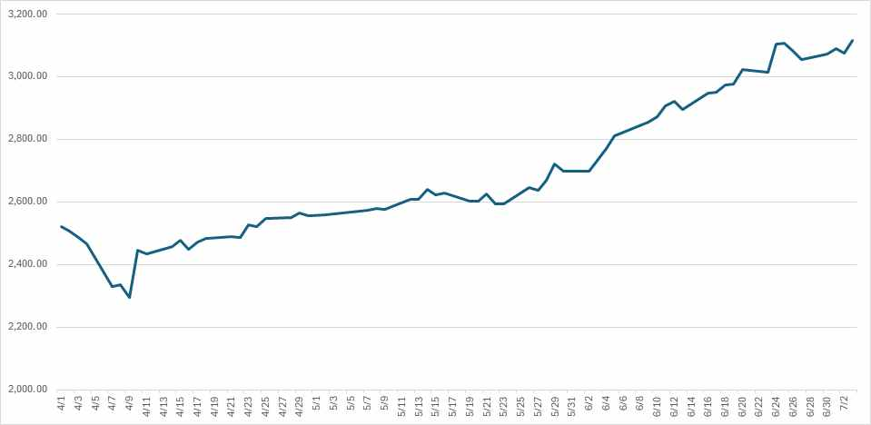
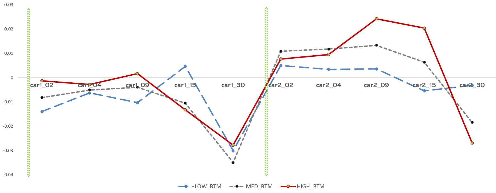

# Expectations of Commercial Act Amendment and Market Reactions: The Potential Mitigation of the "Korea Discount"

**Nara Kang* ․ Heeju Kim***

Received: 2025.11.12. Revision: 1st(2025.12.25.) Accepted: 2025.12.30.
* Associate Professor, College of Business, Hankyong National University (First Author)
** Research Professor, School of Business, Sungkyunkwan University (Corresponding Author)

## Abstract

**[Purpose]** The 2025 amendment to the Korean Commercial Act represents a major institutional reform aimed at improving corporate governance and strengthening shareholder value, which has long been identified as a key source of the Korea Discount phenomenon. This study examines whether stock market reactions to the amendment differ across firms with higher exposure to the Korea Discount, thereby indirectly inferring the potential underlying causes of the Korea Discount.

**[Methodology]** Firms with high exposure to the Korea Discount are identified using a widely adopted proxy from prior literature, the book-to-market ratio (BTM). Specifically, firms in the highest tercile of BTM within each industry-year are classified as the Korea Discount risk group. Market reactions to the amendment are analyzed across two stages based on the degree of information realization and certainty. The first stage captures preliminary expectations, with the event date set as June 2, 2025, the day prior to the presidential election, when the enactment of the amendment was anticipated through campaign pledges. The second stage reflects finalized expectations, with the event date set as July 3, 2025, when the amendment was formally passed by the National Assembly. Market reactions are measured using abnormal returns over event windows surrounding each event date.

**[Findings]** The results show that firms in the Korea Discount risk group—those with high BTM ratios—exhibit significantly positive abnormal returns at both the preliminary and finalized event dates. Moreover, the magnitude of the differential market reaction is larger around the parliamentary passage of the amendment than around the presidential election. In contrast, no significant differential reaction is observed among firms with high controlling shareholder ownership, suggesting that market expectations regarding the amendment are not a uniform reassessment of corporate governance, but are selectively reflected in firms where the amendment is expected to have greater substantive effects.

**[Implications]** This study contributes by leveraging stock market reactions to a major institutional reform to indirectly examine the origins and substance of the Korea Discount phenomenon. Furthermore, the findings imply that corporate governance reform plays an important role in policy discussions aimed at mitigating the Korea Discount.

**Key word:** Korea Discount, Corporate Governance Reform, Commercial Act Amendment

## I. Introduction

The Korea Discount refers to the phenomenon where Korean firms are consistently undervalued compared to their foreign peers. Since the 1997 Asian Financial Crisis, this concept has gained international attention, highlighting how the average price-to-earnings (P/E) ratio of Korean firms remains below global averages. 

Given this background, the 2025 amendment to the Commercial Act is highly significant as it directly addresses corporate governance and shareholder protection—key factors traditionally blamed for the Korea Discount. This study analyzes the market reaction to this institutional event to infer its potential to mitigate the discount.

## II. Review of the Korea Discount and Commercial Act Amendment

### 2.1 The Korea Discount
The Korea Discount is driven by complex ownership structures, opaque corporate governance, private benefit pursuits by controlling shareholders, and geopolitical risks. Previous studies highlight that weak shareholder protections and governance vulnerabilities severely depress firm valuations.

### 2.2 The 2025 Commercial Act Amendment
The amendment passed on July 3, 2025, aims to protect minority shareholders and improve corporate governance. Key changes include:
1. Expanding directors' fiduciary duties from "the company" to "the company and shareholders".
2. Strengthening the independent director system.
3. Applying a strict "3% rule" for electing audit committee members to limit controlling shareholders' voting rights.
4. Mandating electronic shareholder meetings.

## III. Hypothesis Development

**Hypothesis 1:** Market reaction to the passage of the Commercial Act amendment will not show significant differences based on whether the firm's market value is undervalued.
**Hypothesis 2:** Stock price reactions to the amendment among relatively undervalued firms will not show significant differences depending on the probability of the bill's passage.
**Hypothesis 3:** Stock price reactions to the amendment will not differ depending on whether the firm has high controlling shareholder ownership or is an undervalued firm.

## IV. Research Design

The study focuses on non-financial listed firms on KOSPI and KOSDAQ with more than 10 years of operation, resulting in a final sample of 1,229 firms. The analysis employs an event study methodology to observe cumulative abnormal returns (CAR) around the preliminary expectation date (June 2) and the finalized passage date (July 3).

## V. Empirical Results

Results demonstrate that firms with higher Book-to-Market (BTM) ratios experienced significantly higher abnormal returns, especially around the confirmed passage date compared to the preliminary date. This suggests the market views the amendment as a credible structural change benefiting severely undervalued firms.

## VI. Conclusion

This study confirms that the market responded positively to the governance reforms introduced by the 2025 Commercial Act amendment, particularly among firms most exposed to the Korea Discount. These findings underscore the importance of ongoing corporate governance reforms in resolving structural undervaluation issues in the Korean stock market.

*(Note: Translated and summarized from the original Korean manuscript. References and detailed statistical tables omitted for brevity.)*
